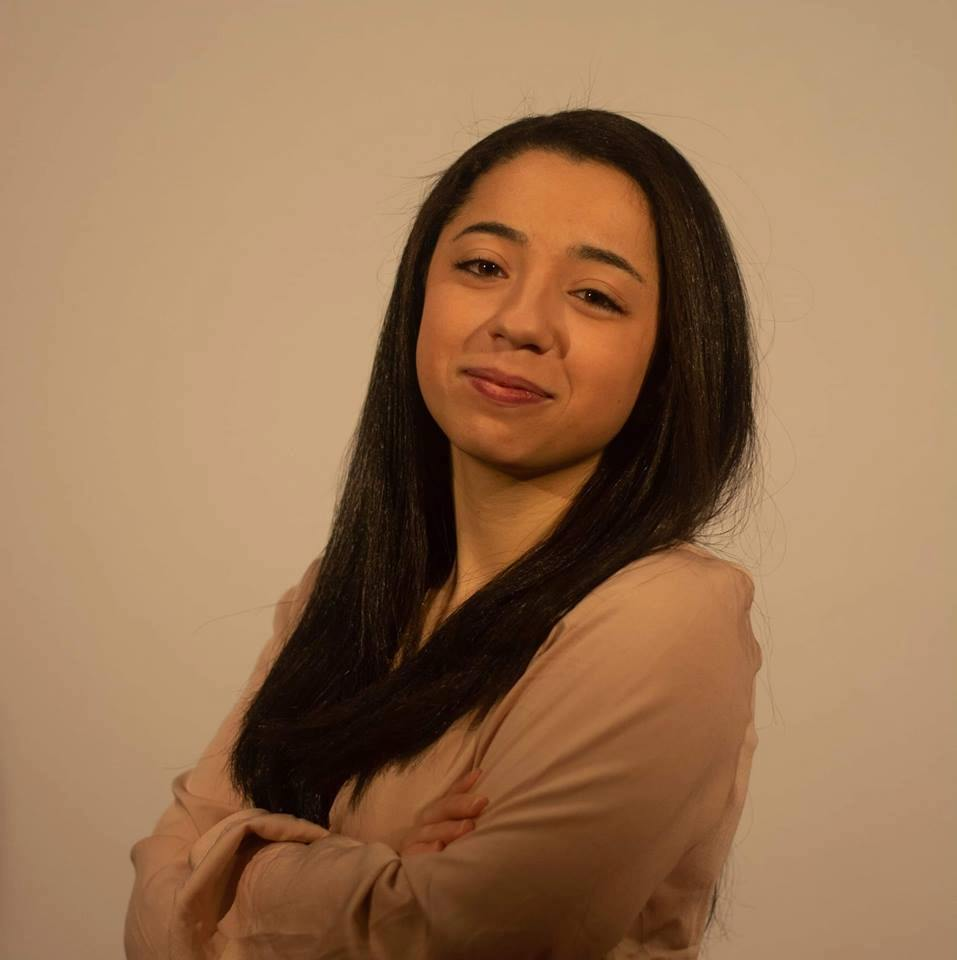
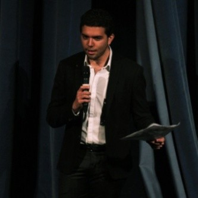

# The Team

## Rita Sekkat

Rita is one of the five founders of HAPPIH. She grew up in Morocco before coming to France.  She is currently student at Sciences Po Paris in Master of public policy and she is doing the gender equality and public policy certificate between Sciences Po and Harvard. She is committed in favor of women’s right. She aims to reduce gender inequality towards the world and break down the menstruation taboo. Rita is also a football player and a football lover and wants to break stereotypes about women playing football.

## Walid Ben Hamadi

Walid Ben Hamadi is a Management and Public Policy student at HEC Paris and Sciences Po Paris. He holds a bachelor’s in social sciences from Sciences Po Paris with a focus on the MENA region. He is particularly interested in the role education, youth empowerment and political awareness can play in reducing inequalities and fostering economic and human development. Walid is also a car enthusiast, and enjoys go-kart racing.

## Charles Culioli

Charles Culioli is a law student at Sciences Po Paris. He holds a bachelor in political sciences from Sciences Po Paris as well as a bachelor in History and Legal Studies from UC Berkeley. He is passionated about issues of social justice, development, and ethics in politics. Charles loves soccer and is an avid squash player.

## Denizalp Goktas

Denizalp is currently a computer science PhD student at Brown University. His research is on algorithmic game theory, computational economics and aritificial intelligene. He previously worked as a researcher under the guidance of Professor Seth Goldstein creating an agent based model of technological automation using C++. He has also worked at Der Norske Bank and Hikma Pharmaceuticals as part of the M&A teams. Denizalp holds a BA in Computer Science-Statistics from Columbia University and a BA from Sciences Po in Political Science and Economics. 