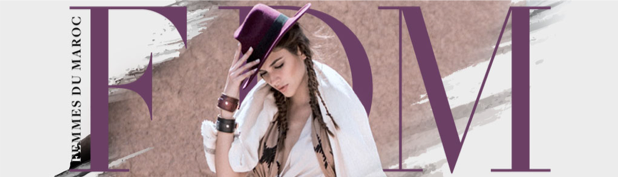
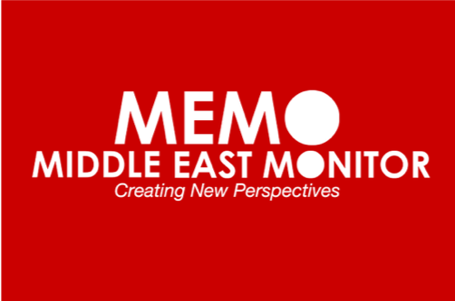
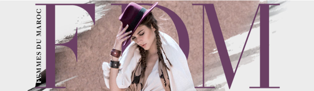

# [#BeHappih, l’initiative estudiantine qui aborde sans tabou le sujet des règles](https://femmesdumaroc.com/actualite/behappih-linitiative-estudiantine-qui-aborde-sans-tabou-le-sujet-des-regles-37498)

« Humanitarian Action for Protection and Preservation of Intimate Hygiene » (HAPPIH) est le nom de l’initiative portée par cinq étudiants de Sciences Po Paris avec le soutien de la Direction de la coopération internationale de Monaco (DCI). Un projet pilote au Maroc entrepris par Charles Culioli, Walid Ben Hamadi, Moez Rais, Rita Sekkat et Denizalp Goktas, originaires de différents pays notamment du royaume. Leurs objectifs ? Soutenir l’enfance vulnérable au Maroc, aborder le sujet tabou des menstruations, et donc changer les mentalités. En effet, il est difficile pour les adolescentes ou jeunes femmes habitant dans un milieu populaire de se payer des serviettes hygiéniques jetables. Résultat : elles se voient dans l’obligation d’arrêter l’école pendant quelques jours, car « une simple tâche de règles à l’école peut être sujet de moqueries ou d’excuses pour ne pas y aller », soulignent les initiateurs du projet. 

# [Students launch #BeHappih campaign to break the menstruation taboo in Morocco](http://moroccanladies.com/breaking-news/students-launch-behappih-campaign-to-break-the-menstruation-taboo-in-morocco-19851 )

Five Sciences Po Paris students are launching in the Marrakech region the first part of their pilot project, “Humanitarian Action for Protection and Preservation of Intimacy Hygiene” (HAPPIH), which unravels the subject of periods. A pilot project in Morocco undertaken by Charles Culioli, Walid Ben Hamadi, Moez Rais, Rita Sekkat and Denizalp Goktas, from different countries including the kingdom. Their aim is to support vulnerable children in Morocco, address the taboo subject of menstruation, and thus change mentalities. The campaign came along with a distribution of washable sanitary towel kits for girls in a boarding school near south of Marrakech.

# [5 étudiants lancent un projet pour briser le tabou des règles au Maroc](https://www.huffpostmaghreb.com/2017/12/11/5-etudiants-lancent-projet-briser-tabou-regles-maroc_n_18785288.html )

MENSTRUATIONS - L'année 2017 aura très certainement réussi à lever (en partie) le voile sur le tabou des règles. Après la couverture explicite du magazine L'Equipe sur les règles chez les sportives, la parution de plusieurs ouvrages sur le sujet ou la création de maillots adaptés, cinq étudiants de Sciences Po Paris veulent eux aussi briser le tabou persistant des menstruations, au Maroc cette fois-ci. 

# [Morocco students raise awareness on female hygiene](https://www.middleeastmonitor.com/20171212-morocco-students-raise-awareness-on-female-hygiene/)

Five students from the Sciences Po Paris University are looking to break the taboo surrounding menstruation in Morocco this year.
The students, from France, Tunisia, Morocco and Turkey, are preparing to conduct an awareness campaign called “Be Happih” this weekend, seeking to raise awareness about intimate hygiene. 
The project, led by Charles Culioli, Walid Ben Hamadi, Moez Rais, Rita Sekkat and Denizalp Goktas, also focuses on the theme of support for vulnerable children in Morocco, the issues affecting young girls and the multiple obstacles to their education and emancipation. The project is integrated “into the goals announced by the country and is linked to gender equality and human development in the poor areas.”

# [Rita Sekkat, membre du groupe à l’origine de Be Happih Campaign](https://open.luxeradio.ma/show/track/5421e013565f7f1afa0cfe8ad87a99ab?fbclid=IwAR0rnRez0mWLG6tQDPeTL_LlcsNGJ9I53ASPwLMoPI8MlMCFz25r-9oGWVQ )

Heure Essentielle accueille Rita Sekkat, membre du groupe à l’origine de Be Happih Campaign. Il s’agit d’un projet porté par 5 étudiants à Sciences Po Paris dont l’objectif est de garantir un meilleur accès à l’hygiène intime pour les jeunes filles issues de milieux ruraux au Maroc

# [#BeHappih : « Les jeunes filles semblaient toutes bien déterminées à briser le tabou des règles » (Interview)](http://femmesdumaroc.com/actualite/behappih-les-jeunes-filles-semblaient-toutes-bien-determinees-a-briser-le-tabou-des-regles-interview-37815#kvsKHFz6j11zKcR4.99 )

Aborder le sujet des règles n’est pas facile mais loin d’être impossible, comme l’ont prouvé les cinq étudiants de Sciences Po Paris qui sont à l’origine du projet » Humanitarian Action for Protection and Preservation of Intimate Hygiene » (HAPPIH). Du 15 au 17 décembre, ils ont sillonné la région de Marrakech et ont rencontré plus de 125 jeunes filles pour évoquer ensemble, et ce, sans complexe, les menstruations. Au début gênées, les adolescentes ont fini par parler de leurs difficultés et de leurs interrogations. Entretien avec Rita Sekkat et Walid Ben Hamadi, deux des cinq initiateurs. 

